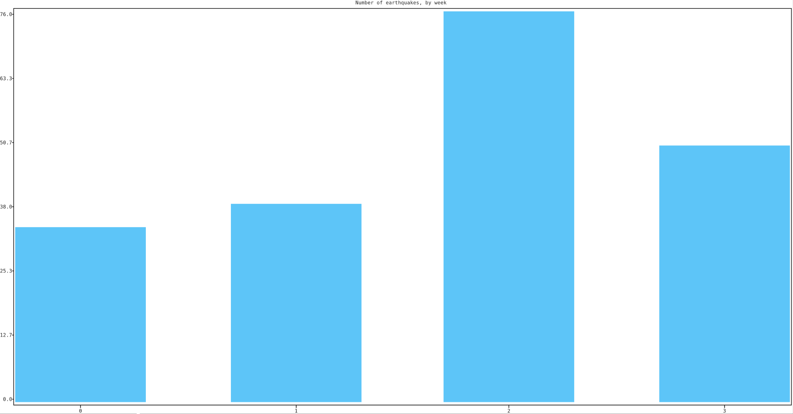
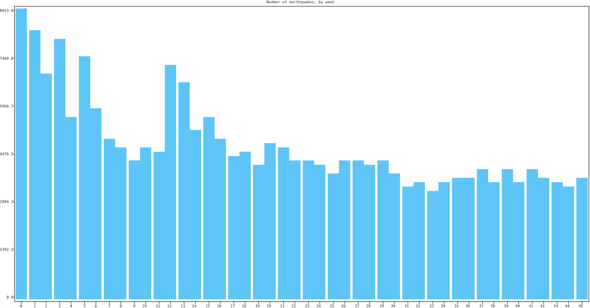
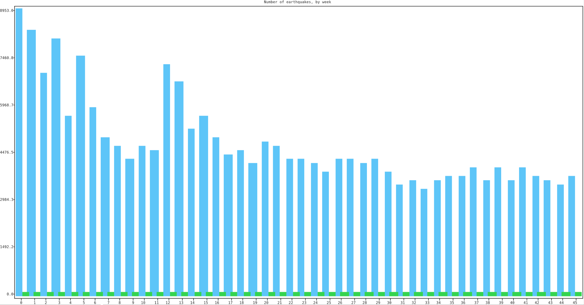
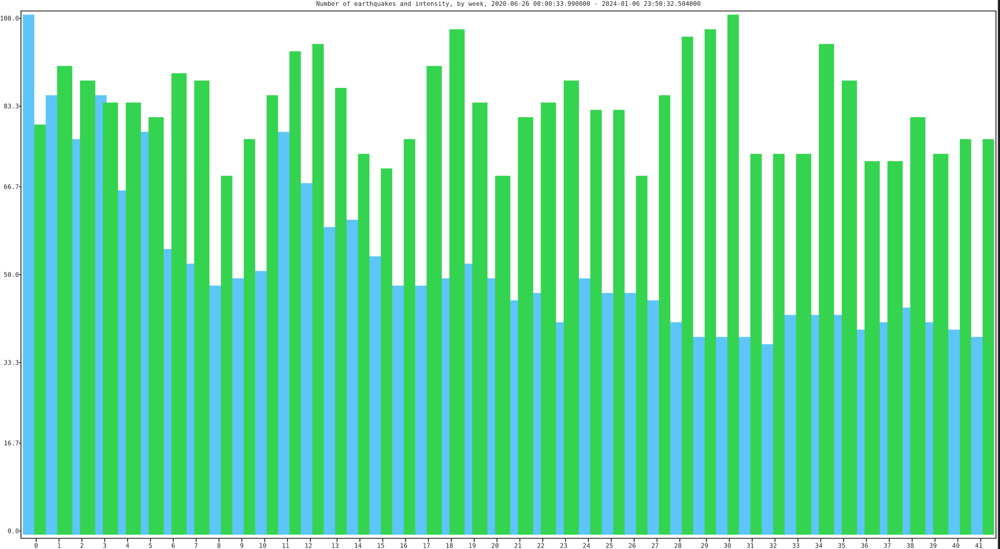

# Earthquakes, Websites and Data Science

I've experienced a number of earthquakes in my life, but ever since moving to Lisbon, the house is shaking almost daily; Granted, I'm living in a very old building that starts vibrating whenever my neighbors washing machine is running, but it's certainly not running as much, as I feel the house shaking.

Because I couldn't find any nice graphs anywhere, I decided to source and graph some data myself.

## Sourcing

My first stop was the Institute for Sea and Atmosphere; I've been on their website many times and figured they provide the most detailed data for Portugal.

### Extract

Their website has a nice table, which displays all data from the last 30 days. No fancy fetch requests mind you; The whole thing is delivered with the first request, and thus accessible with `wget`:

```bash
wget https://www.ipma.pt/en/geofisica/sismicidade/
```

In the HTML file, I found this section:

```
<script type="text/javascript">
var seismicdata_world = {"owner": "IPMA", "country": "PT", "data": [{"areaID": 7, "googlemapref": "", "spotSymbID": -1, "degree": null, "sismoId": "", "dataUpdate": "2023-12-17T06:00:00", "magType": "", "obsRegion": "Morocco", "lon": "-8.4640", "source": "IPMA", "depth": 24, "tensorRef": "", "sensed": null, "shakemapid": "0", "time": "2023-12-10T06:04:13", "lat": "31.0000", "shakemapref": "", "local": null, "magnitud": "-99.0"}
...
</script>
```

We can get the related data, with a simple python script:

```python
import json
import re
from bs4 import BeautifulSoup


html_file = "data/ipma_sismicidade.html"
html_content = open(html_file).read()


soup = BeautifulSoup(html_content, 'html.parser')
data = json.loads(
            re.search(r'var seismicdata_world = ({.*})', html_content).group(1)
        )


date_start = 0
date_end = 0
count = len(data['data'])


for entry in data['data']:
    # format 2023-12-10T11:52:51
    date = datetime.strptime(entry['time'], '%Y-%m-%dT%H:%M:%S')
    if date_start == 0:
        date_start = date
    if date_end == 0:
        date_end = date
    if date_end < date:
        date_end = date
    if date_start > date:
        date_start = date


print("Got %s entries from %s to %s" % (count, date_start, date_end))
```

I run this with:

```bash
$ guix shell python python-beautifulsoup4
$ python3 graph_ipma.py
Got 478 entries from 2023-12-08 13:02:30 to 2024-01-07 08:35:33
```

### Filter

That looks quite little, given that it's supposed to be data from across the world.

Let's filter out stuff, that only relates to Portugal... Even though the JSON already includes a `areaID`, which I presume maps to "Rest of the world", "North Atlantic", "Portugal mainland", "Madeira islands", and "Azores islands" as shown on the website, I figured that I'll try using the coordinates instead.

I start out with a rectangle, that outlines mainland Portugal approx. +/- 150km. Accuracy is not really important here; Earthquakes don't care about borders nor my rectangle.

```
N/W: 42.30, -10.30
N/E: 42.30, -6.30
S/W: 36.30, -10.30
S/E: 36.30, -6.30
```

Time to expand the script:

```python
class Point:
    def __init__(self, x, y):
        self.x = x
        self.y = y


def mk_vector(p1: Point, p2: Point):
    return {'x': (p2.x - p1.x), 'y': (p2.y - p1.y)}


def mk_dot(u, v):
    return u['x'] * v['x'] + u['y'] * v['y']


def point_in_rectangle(point: Point, recta: dict):
    '''Simplistic approach that assumes all corners are 90 degrees'''
    AB = mk_vector(recta['NW'], recta['NE'])
    AM = mk_vector(recta['NW'], point)
    BC = mk_vector(recta['NE'], recta['SW'])
    BM = mk_vector(recta['NE'], point)

    return 0 <= mk_dot(AB, AM) <= mk_dot(AB, AB) \
            and 0 <= mk_dot(BC, BM) <= mk_dot(BC, BC)


region_rectangle = {
    'NW': Point(42.30, -10.30),
    'NE': Point(42.30, -6.30),
    'SW': Point(36.30, -10.30),
    'SE': Point(36.30, -6.30)
}


data_in_region = []
exclude_count = 0


for entry in data['data']:
    point = Point(float(entry['lat']), float(entry['lon']))
    in_region = point_in_rectangle(point, region_rectangle)
    if in_region:
        data_in_region.append(entry)
    else:
        exclude_count += 1


print("Got %s entries in given region; %s entries have been excluded."
      % (len(data_in_region), exclude_count))
```

and run like before:

```bash
$ python3 graph_ipma.py
Got 478 entries from 2023-12-08 13:02:30 to 2024-01-07 08:35:33
Got 214 entries in given region; 264 entries have been excluded.
```

### Plot

At this point I've got data for Portugal, for the past month; That's not much, but let's put it on a graph. I suppose 1-week intervals would be good, and we already know the start-date: `2023-12-08 13:02:30`.

```python
periods = []
interval_hours = 168

total_time = date_end - date_start
total_time_hours = total_time.days * 24 + total_time.seconds / 3600
intervals = total_time_hours / interval_hours


for i in range(0, int(intervals)):
    start = date_start + timedelta(hours=i * interval_hours)
    end = start + timedelta(hours=interval_hours)
    periods.append({'#': i, 'start': start, 'end': end})


for period in periods:
    period['entries'] = []


for entry in data_in_region:
    time = datetime.strptime(entry['time'], '%Y-%m-%dT%H:%M:%S')
    for period in periods:
        if period['start'] <= time <= period['end']:
            period['entries'].append(entry)
            break


plot_labels = []
plot_data = []


for period in periods:
    count = len(period['entries'])
    plot_labels.append(period['#'])
    plot_data.append(count)


import plotext


plotext.bar(plot_labels, plot_data, orientation="vertical", width=3/5)
plotext.title("Number of earthquakes, by week")
plotext.show()
```

To run it, we have to re-create the environment with the plotext dependency:

```bash
guix shell python python-beautifulsoup4 python-plotext
python3 graph_ipma.py
```

Here's what this looks like:



Cool; so over the past 4 weeks, most earthquakes occured in week 3, which I believe includes New Year. I doubt that's because of fireworks though; More likely is that we need significantly more data.

### Expand

I'm not an expert but I would assume that we need at least a couple of years worth of data, to get a better idea of trends:

- Is this an unusually high number of earthquakes?
- Is the frequency, or intensity increasing?
- Can we recognize any patters (ex. smaller quakes, followed by larger quakes)

I am also curious, whether there's a time, before which data becomes meaningless, because the underlying structure has changed so significantly, that it has no relation to current events.

To continue, I searched for a bunch more data sources; I could have probably done this earlier, but half the fun is getting data, that's hard to get.

- https://www.ngdc.noaa.gov/hazel/view/hazards/earthquake/search (historic)
- https://ds.iris.edu/ieb/index.html
- https://seismic-explorer.concord.org
- https://earthquake.usgs.gov/earthquakes/search/ (csv, kml, ...)

The most promising is earthquake.usgs.gov; Of course I'm not going to be downloading years worth of data by hand... a quick check reveals the CSV download link:

```
GET https://earthquake.usgs.gov/fdsnws/event/1/query.csv?starttime=2023-12-08 00:00:00&endtime=2024-01-07 23:59:59&minmagnitude=0&orderby=time
```
Very clean, indeed.

Let's start a new script, to get the last 10 years.

```python
// TODO: ADD SCRIPT: fetch_usgs.py
```

Run with:

```bash
$ guix shell python python-requests
$ python3 fetch_usgs.py -m 2 -d 0

Fetching https://earthquake.usgs.gov/fdsnws/event/1/query.csv?starttime=2023-12-08 00:00:00&endtime=2024-01-07 00:00:00&minmagnitude=0&orderby=time
  Wrote to usgs_data/2023-12-08 00:00:00_2024-01-07 00:00:00.csv
  Timeout for 10 seconds
Fetching https://earthquake.usgs.gov/fdsnws/event/1/query.csv?starttime=2023-11-08 00:00:00&endtime=2023-12-08 00:00:00&minmagnitude=0&orderby=time
  Wrote to usgs_data/2023-11-08 00:00:00_2023-12-08 00:00:00.csv
  Timeout for 10 seconds
Done!
```

Following our previous approach, I wrote a new script to graph the data.I decided to use part of the US west coast because more data was available for the region.

```
region_rectangle = {
    'NW': Point(42.30, -130.30),
    'NE': Point(42.30, -110.30),
    'SW': Point(36.30, -130.30),
    'SE': Point(36.30, -110.30)
}
```

Let's go:

```bash
guix shell python python-beautifulsoup4 python-plotext
python3 graph_usgs.py
```



The script is not very efficient yet; I'll get back to this later. For now I want to add another dimension: Intensity.

My first attempt came out funny. With thousands of quakes, and magnitutes in the lower tens, the scale was useless:



Quick change, to use percentages, gives a more clear picture:

- Blue: Quakes
- Green: Intensity



It looks as though the number of quakes has been decreasing steadily. The intensity remains relatively steady, with what looks like regular fluctuations. It would be interesting to see 8 or more years. 

In our example I can count maybe 7 tops, after each of which, the intensity decreases for ~ 6 months..
